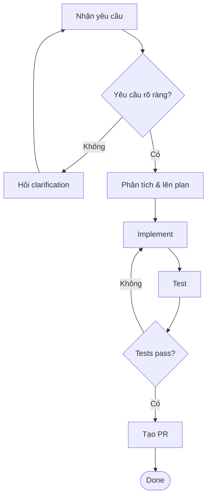

# 🔄 Workflows — Quy Trình Làm Việc

> Workflows mô tả **chuỗi bước tuần tự và có cấu trúc** để hoàn thành một task phức tạp.  
> Thường kết hợp nhiều skills và áp dụng nhiều rules cùng lúc, có checkpoint rõ ràng.

---

## 🤔 Workflow Là Gì? (What is a Workflow?)

Một workflow là tài liệu hướng dẫn agent (và bạn) đi qua **toàn bộ quy trình** của một task từ đầu đến cuối, với các bước rõ ràng, điều kiện rẽ nhánh, và tiêu chí hoàn thành.

**Tương tự như**: BPMN/flowchart trong quy trình nghiệp vụ — có start, steps, decision points, và end.

---

## 🆚 Workflow vs Skill vs Rule

| | Rules | Skills | Workflows |
|---|---|---|---|
| **Phạm vi** | Toàn bộ session | Một task đơn | Một quy trình hoàn chỉnh |
| **Thời gian** | Liên tục | Vài phút | Vài giờ đến vài ngày |
| **Tương tác** | Không | Ít | Nhiều checkpoint |
| **Kết quả** | Hành vi thay đổi | 1 artifact | Nhiều artifacts |
| **Ví dụ** | "Luôn giải thích trước" | "Review code này" | "Phát triển feature A từ đầu đến merge" |

---

## 📁 Files Trong Thư Mục Này

| File | Mô tả |
|------|-------|
| `_template.md` | Template mẫu — copy để tạo workflow mới |
| `new-feature-development.md` | Phát triển feature từ yêu cầu đến PR |
| `bug-investigation.md` | Điều tra và fix bug có hệ thống |
| `web-ui-functional-testing-workflow.md` | Quy trình phối hợp kiểm thử chức năng giao diện web |

---

## 🔑 Anatomy Của Một Workflow

```
Workflow = Trigger + Prerequisites + Steps (với Checkpoints) + Expected Outcome
```

**Trigger**: Điều kiện bắt đầu workflow
```
- "Khi nhận được yêu cầu feature mới"
- "Khi có bug report từ user"
- "Khi cần release phiên bản mới"
```

**Prerequisites**: Những gì cần có sẵn trước khi bắt đầu
```
- Access vào repo
- Môi trường dev đã setup
- Thông tin yêu cầu đầy đủ
```

**Steps với Checkpoints**: Các bước thực hiện, mỗi bước có tiêu chí hoàn thành
```
Phase 1: Analysis (checkpoint: document yêu cầu được approve)
Phase 2: Implementation (checkpoint: code pass tests)
Phase 3: Review (checkpoint: PR được merge)
```

**Expected Outcome**: Trạng thái cuối cùng khi workflow hoàn thành
```
- Feature được deploy lên staging
- Tests coverage ≥ 80%
- Documentation được cập nhật
```

---

## ✍️ Hướng Dẫn Viết Workflow (How to Write a Workflow)

### Bước 1: Copy template
```bash
cp workflows/_template.md workflows/ten-workflow-moi.md
```

### Bước 2: Xác định scope rõ ràng

Workflow cần trả lời được:
- Bắt đầu từ **trạng thái nào**?
- Kết thúc ở **trạng thái nào**?
- **Ai** thực hiện mỗi bước (bạn hay agent)?
- Khi nào **dừng** và chờ input từ bạn?

### Bước 3: Sử dụng Mermaid diagram

Mỗi workflow nên có flowchart để visualize:



### Bước 4: Phân chia thành Phases

Nhóm các bước liên quan thành **phases** (giai đoạn):

```markdown
## Phase 1: Analysis & Planning ⏱️ ~30 phút
## Phase 2: Implementation ⏱️ ~2-4 giờ
## Phase 3: Testing & Review ⏱️ ~1 giờ
```

---

## 🚀 Cách Chạy Workflow (How to Run)

### Option A: Dẫn dắt từng phase
```
Bắt đầu workflow "New Feature Development" cho task: [mô tả].
Chúng ta sẽ đi qua từng phase, dừng lại ở mỗi checkpoint để tôi review.
```

### Option B: Chạy tự động một phase
```
Thực hiện Phase 2 của workflow bug-investigation.md với bug report sau: [...]
```

### Option C: Dùng như checklist
```
Dùng workflow new-feature-development.md như checklist.
Tôi đang ở Phase 2, Step 3. Tiếp tục từ đây.
```

---

## 🔗 Liên Kết Giữa Workflow, Skills và Rules

Workflow nên tham chiếu tường minh đến:

```markdown
**Skills được sử dụng trong workflow này:**
- [code-review](../skills/code-review.md) — Dùng ở Phase 3
- [debug-assistant](../skills/debug-assistant.md) — Dùng khi có lỗi

**Rules áp dụng:**
- [coding-standards](../rules/coding-standards.md) — Áp dụng suốt Phase 2
- [communication-style](../rules/communication-style.md) — Áp dụng khi báo cáo
```

---

## ⚠️ Lưu Ý Quan Trọng

> [!IMPORTANT]
> Mỗi workflow phải có **checkpoint rõ ràng** — điểm mà agent dừng lại và chờ bạn xác nhận trước khi tiếp tục. Không để agent chạy xuyên suốt mà không có điểm kiểm soát.

> [!TIP]
> Nếu workflow quá dài (> 10 steps), hãy xem xét tách thành 2 workflow riêng, hoặc nhóm bước thành sub-phases với mermaid diagram phụ.

> [!NOTE]
> Ghi **thời gian ước tính** cho mỗi phase — giúp bạn và agent quản lý kỳ vọng tốt hơn.

---

*Xem template tại [`_template.md`](./_template.md)*
