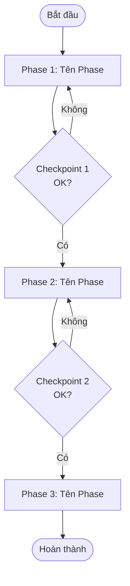

---
# Metadata — điền đầy đủ trước khi sử dụng
id: workflow-[slug-ngắn]         # Ví dụ: workflow-new-feature
name: "[Tên Workflow Rõ Ràng]"   # Ví dụ: "New Feature Development"
tags: [development, planning]    # Các tag liên quan
version: "1.0.0"
created: YYYY-MM-DD
updated: YYYY-MM-DD
author: "[Tên bạn]"
estimated_duration: "~[X] giờ"  # Tổng thời gian ước tính
phases: 3                         # Số phases trong workflow
---

# [Tên Workflow]

> **Mô tả ngắn gọn** (1-2 câu): Workflow này dẫn dắt quy trình nào và kết quả cuối cùng là gì.

---

## 🚀 Trigger — Khi Nào Dùng Workflow Này?

<!-- Điều kiện hoặc tình huống bắt đầu workflow -->

Sử dụng workflow này khi:
- [Tình huống 1]
- [Tình huống 2]
- [Tình huống 3]

---

## 📋 Điều Kiện Tiên Quyết (Prerequisites)

<!-- Những gì cần có sẵn TRƯỚC KHI bắt đầu workflow -->
<!-- Nếu thiếu bất kỳ điều kiện nào, workflow sẽ không thể hoàn thành -->

### Thông tin cần có
- [ ] [Thông tin 1 — ví dụ: "Mô tả yêu cầu/ticket đầy đủ"]
- [ ] [Thông tin 2]

### Công cụ / Access cần có
- [ ] [Tool/Access 1 — ví dụ: "Access vào Git repository"]
- [ ] [Tool/Access 2]

### Skills tham chiếu
- [`[skill-1]`](../skills/skill-1.md)
- [`[skill-2]`](../skills/skill-2.md)

### Rules áp dụng
- [`[rule-1]`](../rules/rule-1.md)
- [`[rule-2]`](../rules/rule-2.md)

---

## 🗺️ Flow Diagram

---

## 📌 Các Phase & Bước Chi Tiết

---

### Phase 1: [Tên Phase] ⏱️ ~[X] phút

**Mục tiêu phase này**: [Mô tả mục tiêu và kết quả cần đạt]

#### Bước 1.1: [Tên bước]

**Ai thực hiện**: 🤖 Agent | 👤 Bạn | 🤝 Cả hai  
**Action**:
- [Hành động cụ thể]
- [Chi tiết thêm nếu cần]

**Output**:
- [Kết quả cần tạo ra]

#### Bước 1.2: [Tên bước]

**Ai thực hiện**: 🤖 Agent | 👤 Bạn | 🤝 Cả hai  
**Action**:
- [Hành động cụ thể]

**Output**:
- [Kết quả]

#### ✅ Checkpoint 1

> **Dừng lại và xác nhận trước khi tiếp tục Phase 2.**

Tiêu chí hoàn thành Phase 1:
- [ ] [Tiêu chí 1]
- [ ] [Tiêu chí 2]
- [ ] [Tiêu chí 3]

---

### Phase 2: [Tên Phase] ⏱️ ~[X] giờ

**Mục tiêu phase này**: [Mô tả mục tiêu]

#### Bước 2.1: [Tên bước]

**Ai thực hiện**: 🤖 Agent | 👤 Bạn | 🤝 Cả hai  
**Action**:
- [Hành động]

**Output**:
- [Kết quả]

#### Bước 2.2: [Tên bước]

**Ai thực hiện**: 🤖 Agent | 👤 Bạn | 🤝 Cả hai  
**Action**:
- [Hành động]

**Output**:
- [Kết quả]

#### ✅ Checkpoint 2

> **Dừng lại và xác nhận trước khi tiếp tục Phase 3.**

Tiêu chí hoàn thành Phase 2:
- [ ] [Tiêu chí 1]
- [ ] [Tiêu chí 2]

---

### Phase 3: [Tên Phase] ⏱️ ~[X] phút

**Mục tiêu phase này**: [Mô tả mục tiêu]

#### Bước 3.1: [Tên bước]

**Ai thực hiện**: 🤖 Agent | 👤 Bạn | 🤝 Cả hai  
**Action**:
- [Hành động]

**Output**:
- [Kết quả]

#### ✅ Checkpoint Cuối — Definition of Done

Workflow hoàn thành khi:
- [ ] [Tiêu chí 1]
- [ ] [Tiêu chí 2]
- [ ] [Tiêu chí 3]
- [ ] [Tiêu chí 4]

---

## 🎯 Kết Quả Mong Đợi (Expected Outcome)

<!-- Mô tả trạng thái cuối cùng sau khi workflow hoàn thành -->

Sau khi hoàn thành workflow này:
- [Kết quả 1]
- [Kết quả 2]
- [Kết quả 3]

---

## 🔀 Xử Lý Trường Hợp Đặc Biệt (Edge Cases)

<!-- Các tình huống ngoài luồng thông thường và cách xử lý -->

### Khi [tình huống đặc biệt 1]
→ [Hành động cần làm]

### Khi [tình huống đặc biệt 2]
→ [Hành động cần làm]

---

## ⚠️ Lưu Ý (Notes)

<!-- Những điều quan trọng cần nhớ khi chạy workflow này -->

> [!IMPORTANT]
> [Lưu ý quan trọng nhất của workflow]

- **[Lưu ý 1]**: [Giải thích]
- **[Lưu ý 2]**: [Giải thích]

---

## 📝 Lịch Sử Thay Đổi (Changelog)

| Version | Ngày | Thay đổi |
|---------|------|---------|
| 1.0.0 | YYYY-MM-DD | Khởi tạo |
