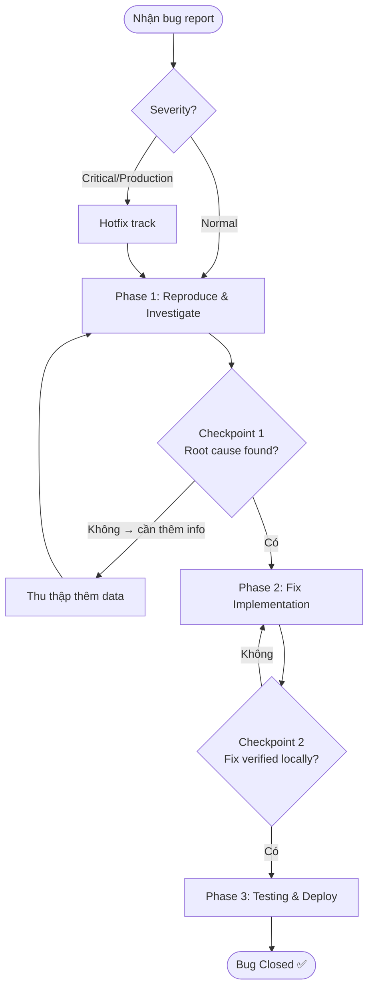

# Bug Investigation & Fix

> Quy trình điều tra và fix bug một cách có hệ thống: từ báo lỗi đến verify fix hoàn chỉnh.  
> Áp dụng cho bugs không rõ nguyên nhân, bugs production nghiêm trọng, hoặc bugs tái diễn.

---

## 🚀 Trigger — Khi Nào Dùng Workflow Này?

Sử dụng workflow này khi:
- Nhận được bug report từ user hoặc monitoring system
- Phát hiện bug trong quá trình development mà nguyên nhân không rõ ràng
- Bug đã xảy ra nhiều lần và cần tìm root cause thay vì patch tạm

---

## 📋 Điều Kiện Tiên Quyết (Prerequisites)

### Thông tin cần có
- [ ] Mô tả bug (error message, stack trace, hoặc mô tả behavior)
- [ ] Môi trường xảy ra bug (dev / staging / production)
- [ ] Reproduction steps (nếu có)

### Công cụ / Access cần có
- [ ] Access vào logs (application logs, error tracking như Sentry)
- [ ] Quyền reproduce bug trên môi trường phù hợp
- [ ] Access vào Git repository

### Skills tham chiếu
- [`debug-assistant`](../skills/debug-assistant.md) — Core skill dùng trong Phase 1
- [`code-review`](../skills/code-review.md) — Dùng ở Phase 2 để review fix

### Rules áp dụng
- [`coding-standards`](../rules/coding-standards.md) — Áp dụng khi viết fix
- [`communication-style`](../rules/communication-style.md) — Áp dụng khi báo cáo status

---

## 🗺️ Flow Diagram

---

## 📌 Các Phase & Bước Chi Tiết

---

### Phase 1: Reproduce & Investigate ⏱️ ~30-90 phút

**Mục tiêu**: Reproduce được bug ổn định và xác định root cause chính xác.

#### Bước 1.1: Triage — Đánh Giá Mức Độ Nghiêm Trọng

**Ai thực hiện**: 🤝 Cả hai  
**Action**:
- Phân loại severity:
  - 🔴 **Critical**: Production down, data loss, security breach
  - 🟠 **High**: Feature không dùng được, ảnh hưởng nhiều users
  - 🟡 **Medium**: Feature bị ảnh hưởng nhưng có workaround
  - 🟢 **Low**: Cosmetic, edge case hiếm gặp
- Với Critical: notify ngay, ưu tiên tuyệt đối, có thể skip một số bước

**Output**:
- [ ] Severity được xác định
- [ ] Stakeholders được notify (nếu Critical/High)

#### Bước 1.2: Reproduce Bug

**Ai thực hiện**: 👤 Bạn  
**Action**:
- Tìm cách reproduce bug ổn định (deterministic)
- Nếu không reproduce được: collect thêm thông tin (logs, timing, điều kiện đặc biệt)
- Document chính xác reproduction steps

**Output**:
- [ ] Có reproduction steps rõ ràng
- [ ] Bug được confirm reproduce được

> [!WARNING]
> Nếu không reproduce được sau 30 phút: dừng lại, collect logs từ environment nơi bug xảy ra, và cung cấp cho agent ở bước tiếp theo.

#### Bước 1.3: Debug Investigation

**Ai thực hiện**: 🤖 Agent (dùng skill debug-assistant)  
**Action**:
- Agent chạy skill [`debug-assistant`](../skills/debug-assistant.md) với thông tin đã có
- Đề xuất hypotheses và investigation plan
- Bạn thực hiện investigation plan và report kết quả

**Output**:
- [ ] Danh sách hypotheses (từ likely nhất đến ít likely nhất)
- [ ] Investigation steps đã thực hiện
- [ ] Evidence thu thập được

#### Bước 1.4: Xác Nhận Root Cause

**Ai thực hiện**: 🤝 Cả hai  
**Action**:
- Agent suy luận root cause từ evidence
- Bạn confirm root cause có hợp lý không
- Document root cause chính thức

**Output**:
- [ ] Root cause được xác định rõ ràng
- [ ] Root cause được phân biệt với immediate cause

#### ✅ Checkpoint 1 — Root Cause Confirmed

> **Dừng lại. Confirm root cause trước khi bắt đầu fix.**

Tiêu chí hoàn thành Phase 1:
- [ ] Bug reproduce được ổn định (hoặc có evidence rõ ràng từ logs)
- [ ] Root cause đã được xác định và giải thích
- [ ] Severity đã được triage
- [ ] **Bạn đồng ý với root cause analysis** → Phase 2 bắt đầu

---

### Phase 2: Fix Implementation ⏱️ ~30 phút - 2 giờ

**Mục tiêu**: Implement fix đúng cho root cause (không phải patch symptom).

#### Bước 2.1: Thiết Kế Fix

**Ai thực hiện**: 🤖 Agent  
**Action**:
- Đề xuất fix strategy: fix root cause, không phải symptom
- Nếu có nhiều cách: trình bày trade-offs (quick patch vs proper fix)
- Xác định scope của fix: files nào cần thay đổi

**Output**:
- [ ] Fix strategy được chọn và có lý do
- [ ] Potential side effects đã được xem xét

#### Bước 2.2: Implement Fix

**Ai thực hiện**: 🤝 Cả hai  
**Action**:
- Tạo branch: `bugfix/[ticket-id]-[mô-tả-ngắn]`
- Implement fix theo strategy đã chọn
- Commit với message rõ ràng: `fix([scope]): [mô tả vấn đề đã fix]` (Agent **LUÔN** chủ động gợi ý commit message tương ứng sau khi đề xuất hoặc thực hiện thay đổi)

**Output**:
- [ ] Fix implemented trên branch riêng
- [ ] Commit message đúng format

#### Bước 2.3: Review Fix

**Ai thực hiện**: 🤖 Agent (dùng skill code-review)  
**Action**:
- Chạy skill [`code-review`](../skills/code-review.md) trên code fix
- Đặc biệt focus vào: không tạo ra bugs mới, không làm hỏng functionality khác

**Output**:
- [ ] Code review report
- [ ] Không có Critical/Major issues mới

#### ✅ Checkpoint 2 — Fix Ready

Tiêu chí hoàn thành Phase 2:
- [ ] Fix address đúng root cause (không phải patch symptom)
- [ ] Code review không có Critical/Major issues
- [ ] Fix build thành công
- [ ] Logic của fix được bạn hiểu và đồng ý

---

### Phase 3: Testing & Close ⏱️ ~30-60 phút

**Mục tiêu**: Verify fix hoạt động, viết regression test, và đóng bug.

#### Bước 3.1: Verify Fix

**Ai thực hiện**: 👤 Bạn  
**Action**:
- Test trực tiếp với reproduction steps từ Phase 1
- Bug không còn xuất hiện nữa

**Output**:
- [ ] Bug đã fix: reproduction steps không còn trigger bug

#### Bước 3.2: Viết Regression Test

**Ai thực hiện**: 🤖 Agent  
**Action**:
- Viết automated test (unit/integration) cover đúng bug case
- Test phải fail trước fix và pass sau fix
- Tên test mô tả rõ bug gì: `should handle [edge case] correctly`

**Output**:
- [ ] Regression test viết xong và pass
- [ ] Test được commit cùng với fix

#### Bước 3.3: Regression Testing

**Ai thực hiện**: 👤 Bạn  
**Action**:
- Chạy full test suite để kiểm tra không có regression
- Test thủ công các features liên quan

**Output**:
- [ ] Full test suite pass
- [ ] Không có regression

#### Bước 3.4: Tạo PR & Đóng Bug

**Ai thực hiện**: 🤖 Agent (draft) → 👤 Bạn (submit)  
**Action**:
- Tạo PR với description:
  - Bug description
  - Root cause identified
  - Fix approach
  - How to verify
- Đóng bug ticket với link PR

**Output**:
- [ ] PR tạo xong
- [ ] Bug ticket được đóng/update status

#### ✅ Checkpoint Cuối — Bug Closed

Workflow hoàn thành khi:
- [ ] Bug không còn reproduce được
- [ ] Regression test đã viết và pass
- [ ] Full test suite pass, không có regression
- [ ] PR merge xong (hoặc đang review)
- [ ] Bug ticket closed với root cause được document

---

## 🎯 Kết Quả Mong Đợi (Expected Outcome)

Sau khi hoàn thành workflow này:
- Bug được fix đúng root cause, không tái diễn
- Có regression test để prevent bug này trong tương lai
- Root cause được document để team rút kinh nghiệm
- Codebase không có regression từ fix

---

## 🔀 Xử Lý Trường Hợp Đặc Biệt (Edge Cases)

### Khi bug Critical trên Production
→ Áp dụng Hotfix track: tạo branch từ `main`, fix nhanh, hotfix PR → merge `main` → cherry-pick về `develop`. Document root cause sau.

### Khi không tìm được root cause sau 90 phút
→ Dừng lại, escalate. Cung cấp cho người khác: symptoms, evidence đã collect, hypotheses đã loại trừ.

### Khi fix quá lớn, vượt scope của bugfix
→ Tách làm 2 PRs: (1) minimal fix cho bug, (2) refactor/improvement riêng với proper planning.

### Khi bug là do third-party library
→ Tìm workaround trong code mình, report bug lên library issue tracker, theo dõi updates.

---

## ⚠️ Lưu Ý (Notes)

> [!IMPORTANT]
> Không bao giờ fix symptom thay vì root cause — đây là nguyên nhân phổ biến nhất khiến bugs tái diễn sau vài sprint.

> [!WARNING]
> Với Critical bugs trên Production: ưu tiên là **restore service** (có thể revert), không phải **fix đẹp**. Fix đúng sau khi service đã recover.

> [!TIP]
> Regression test là bắt buộc, không phải optional. Nếu không có test, bug SẼ tái diễn.

---

## 📝 Lịch Sử Thay Đổi (Changelog)

| Version | Ngày | Thay đổi |
|---------|------|---------|
| 1.0.0 | 2026-06-08 | Khởi tạo |
| 1.0.1 | 2026-06-13 | Thêm quy tắc Agent luôn gợi ý commit message sau mỗi thay đổi |
