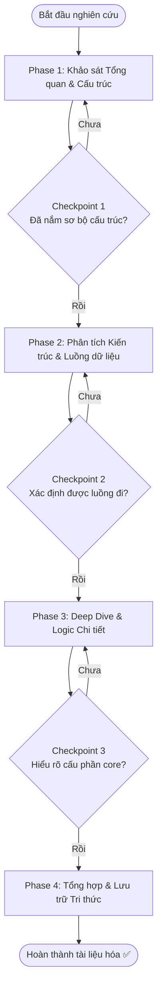

# Codebase Understanding & Analysis Workflow

> Quy trình từng bước giúp Developer hoặc AI Agent tiếp cận, phân tích, đọc hiểu và nắm bắt toàn diện một codebase mới hoặc một module/cấu phần phức tạp trong dự án.  
> Áp dụng khi bắt đầu tham gia một dự án mới, khi tiếp nhận một module nghiệp vụ phức tạp, hoặc trước khi thực hiện các đợt refactor lớn.

---

## 🚀 Trigger — Khi Nào Dùng Workflow Này?

Sử dụng workflow này khi:
- Mới tham gia (onboarding) vào một dự án/repository mới.
- Cần nghiên cứu một module hoặc thư viện phức tạp mà chưa nắm rõ logic hoạt động.
- Cần chuẩn bị kiến thức nền tảng trước khi phát triển một tính năng lớn (Epic/Feature) có tầm ảnh hưởng rộng.
- Cần thực hiện tái cấu trúc (refactor) một cấu phần core của hệ thống.

---

## 📋 Điều Kiện Tiên Quyết (Prerequisites)

### Thông tin cần có
- [ ] Đường dẫn mã nguồn (repository hoặc folder workspace).
- [ ] Tài liệu hướng dẫn cài đặt và vận hành (README.md, setup guides) nếu có.
- [ ] Mục tiêu phân tích (ví dụ: "Nắm luồng lưu trữ dữ liệu đồ thị", "Hiểu cách phân quyền người dùng", v.v.).

### Công cụ / Access cần có
- [ ] IDE hoặc công cụ duyệt code có hỗ trợ tìm kiếm toàn cục (Ripgrep/Grep, Go-to-definition).
- [ ] Quyền truy cập vào database hoặc môi trường chạy thử (nếu cần chạy thử để trace log).

### Skills tham chiếu
- [`code-review`](../skills/code-review.md) — Hỗ trợ đánh giá chất lượng và cấu trúc code trong Phase 3.

### Rules áp dụng
- [`communication-style`](../rules/communication-style.md) — Áp dụng khi phản hồi và báo cáo kết quả phân tích.
- [`coding-standards`](../rules/coding-standards.md) — Định hình hiểu biết về chuẩn mực code của dự án.

---

## 🗺️ Flow Diagram

---

## 📌 Các Phase & Bước Chi Tiết

---

### Phase 1: Khảo Sát Tổng Quan & Cấu Trúc ⏱️ ~30-60 phút

**Mục tiêu phase này**: Xác định các công nghệ cốt lõi, công cụ build và cấu trúc thư mục chính của dự án để tạo ra một bản đồ tư duy sơ bộ.

#### Bước 1.1: Nhận diện Công nghệ & Cấu hình Build
**Ai thực hiện**: 🤖 Agent  
**Action**:
- Đọc các tệp cấu hình build chính (`pom.xml`, `build.gradle`, `package.json`, `go.mod`, `Cargo.toml`, v.v.).
- Liệt kê danh sách các thư viện/dependencies quan trọng (ví dụ: Spring Boot, Neo4j, Hibernate, React, v.v.).
- Đọc file `README.md` chính để nắm cách cài đặt, chạy ứng dụng và các mô tả tổng quan.

**Output**:
- Danh sách các công nghệ, framework chủ chốt và phiên bản sử dụng.

#### Bước 1.2: Phân tích Cấu trúc Thư mục (Directory Mapping)
**Ai thực hiện**: 🤖 Agent  
**Action**:
- Sử dụng các công cụ liệt kê thư mục để lập bản đồ cấu trúc project.
- Xác định vị trí của các lớp (layers) hoặc module quan trọng (ví dụ: controllers, services, repositories, configurations, DTOs, entities).
- Định vị các tệp cấu hình môi trường (`application.properties`, `.env`, `docker-compose.yml`, v.v.).

**Output**:
- Sơ đồ cây thư mục rút gọn kèm mô tả chức năng của từng thư mục chính.

#### ✅ Checkpoint 1
> **Xác nhận đã hiểu bức tranh tổng thể trước khi đi sâu vào logic.**

Tiêu chí hoàn thành Phase 1:
- [ ] Xác định được các entry points (điểm khởi đầu) của ứng dụng.
- [ ] Nắm rõ công nghệ cốt lõi và các dependencies chính.
- [ ] Định vị được nơi chứa mã nguồn nghiệp vụ chính.

---

### Phase 2: Phân Tích Kiến Trúc & Luồng Dữ Liệu ⏱️ ~1-2 giờ

**Mục tiêu phase này**: Xác định mô hình kiến trúc tổng thể và cách dữ liệu luân chuyển qua các tầng trong hệ thống.

#### Bước 2.1: Xác định Kiến trúc Tổng thể (Architecture Pattern)
**Ai thực hiện**: 🤖 Agent  
**Action**:
- Phân tích xem dự án tuân theo kiến trúc nào (Layered Architecture, Clean/Hexagonal Architecture, MVC, Microservices, Event-Driven).
- Xác định cách các tầng giao tiếp với nhau và các quy tắc phụ thuộc (dependency rules) giữa các tầng.

#### Bước 2.2: Trace Luồng Đi Điển Hình (Request Tracing)
**Ai thực hiện**: 🤝 Cả hai  
**Action**:
- Chọn một luồng nghiệp vụ cơ bản nhưng tiêu biểu (ví dụ: API tạo mới người dùng hoặc truy vấn dữ liệu đồ thị).
- Trace mã nguồn từ điểm tiếp nhận yêu cầu (Route/Controller) qua tầng xử lý nghiệp vụ (Service) đến tầng lưu trữ (Repository/Database).
- Vẽ sơ đồ Sequence thể hiện sự tương tác giữa các lớp này.

**Output**:
- Sơ đồ Mermaid Sequence Diagram mô tả luồng đi của request.

#### ✅ Checkpoint 2
Tiêu chí hoàn thành Phase 2:
- [ ] Gọi tên được mô hình kiến trúc dự án đang áp dụng.
- [ ] Vẽ hoặc mô tả được luồng đi hoàn chỉnh của một request/dataflow.

---

### Phase 3: Deep Dive & Logic Chi Tiết ⏱️ ~1-2 giờ

**Mục tiêu phase này**: Đọc và hiểu sâu về logic xử lý của các class/module core, các cơ chế xử lý nền tảng.

#### Bước 3.1: Phân tích Cấu phần Cốt lõi (Core Components)
**Ai thực hiện**: 🤖 Agent  
**Action**:
- Đi sâu vào phân tích các cấu phần quan trọng liên quan đến nghiệp vụ mục tiêu (ví dụ: các thuật toán đồ thị, logic xử lý giao dịch tài chính, cơ chế phân quyền).
- Phân tích cách hệ thống giao tiếp với bên ngoài hoặc cơ sở dữ liệu (ví dụ: Neo4j Repository, SQL Database Connection, REST Client).

#### Bước 3.2: Khảo sát các Cơ chế Hạ tầng (Cross-cutting Concerns)
**Ai thực hiện**: 🤖 Agent  
**Action**:
- Xem xét cách dự án giải quyết các vấn đề chung:
  - **Exception Handling**: Có global exception handler không? Lỗi được định dạng thế nào?
  - **Logging**: Mức độ log, định dạng log, và thư viện log được sử dụng.
  - **Security**: Cơ chế authentication/authorization (JWT, OAuth2, Session).
  - **Transactions**: Cách quản lý transaction (ví dụ: `@Transactional` trong Spring).

#### ✅ Checkpoint 3
Tiêu chí hoàn thành Phase 3:
- [ ] Hiểu được cách triển khai chi tiết của các class/component cốt lõi.
- [ ] Nắm được cách hệ thống xử lý lỗi, bảo mật và tương tác với Database.

---

### Phase 4: Tổng Hợp & Lưu Trữ Tri Thức ⏱️ ~30-60 phút

**Mục tiêu phase này**: Hệ thống hóa toàn bộ kiến thức thu thập được thành tài liệu có thể tái sử dụng để tránh việc phải tìm hiểu lại từ đầu.

#### Bước 4.1: Tạo Tài liệu Tri thức (Knowledge Item - KI)
**Ai thực hiện**: 🤖 Agent  
**Action**:
- Tạo một file Markdown tổng hợp kết quả nghiên cứu. Nên đặt trong thư mục artifacts hoặc thư mục tài liệu dự án.
- Cấu trúc tài liệu KI đề xuất:
  - Tóm tắt kiến trúc & công nghệ.
  - Các lớp/thành phần quan trọng cần lưu ý kèm đường dẫn file (`file:///...`).
  - Sơ đồ luồng dữ liệu (Mermaid).
  - Các lưu ý đặc biệt, "gotchas", hoặc các quy ước ngầm trong code.
  - Hướng dẫn cài đặt/chạy thử nhanh (nếu có bổ sung so với README gốc).

**Output**:
- File Markdown tài liệu phân tích hệ thống (ví dụ: `codebase_analysis_report.md`).

#### Bước 4.2: Xác minh & Chuyển giao
**Ai thực hiện**: 🤝 Cả hai  
**Action**:
- Gửi tài liệu phân tích cho Developer xem xét và xác nhận độ chính xác.
- Bổ sung hoặc điều chỉnh dựa trên phản hồi của Developer.

#### ✅ Checkpoint Cuối — Definition of Done
Workflow hoàn thành khi:
- [ ] Có sơ đồ cấu trúc thư mục và danh sách công nghệ.
- [ ] Có sơ đồ Sequence Diagram mô tả luồng đi chính của dữ liệu.
- [ ] Logic cốt lõi của các component mục tiêu được giải thích rõ ràng.
- [ ] Tài liệu phân tích được hoàn thiện, lưu trữ và được Developer phê duyệt.

---

## 🎯 Kết Quả Mong Đợi (Expected Outcome)

Sau khi hoàn thành workflow này:
- Người đọc (Developer mới hoặc Agent) có thể tự tin sửa code, thêm tính năng hoặc refactor mà không sợ phá vỡ kiến trúc hiện tại.
- Dự án có thêm một tài liệu phân tích hệ thống chi tiết, trực quan (có sơ đồ Mermaid) làm tài liệu tham khảo cho tương lai.

---

## 🔀 Xử Lý Trường Hợp Đặc Biệt (Edge Cases)

### Khi codebase quá lớn (Legacy Monolith)
→ Không cố gắng đọc hết toàn bộ dự án. Hãy khoanh vùng (scope) xung quanh tính năng/module mục tiêu. Đọc file config và cấu trúc thư mục để nắm tổng quan trước, sau đó chỉ đi sâu vào luồng code trực tiếp liên quan đến mục tiêu.

### Khi code thiếu tài liệu và rối rắm (Spaghetti Code)
→ Ưu tiên việc trace luồng bằng debug log hoặc chạy thử (runtime tracing). Viết thêm unit test đơn giản hoặc dùng log statements để hiểu cách dữ liệu thay đổi thay vì chỉ đọc code tĩnh.

### Khi gặp các công nghệ hoặc thư viện mới chưa từng sử dụng
→ Dành riêng 30 phút để đọc tài liệu chính thức (official documentation) hoặc làm các ví dụ nhỏ (Quickstart) của thư viện đó trước khi quay lại đọc code dự án.

---

## ⚠️ Lưu Ý (Notes)

> [!IMPORTANT]
> Luôn giữ nguyên các comment, javadoc/docstring hiện có trong source code. Không tự ý chỉnh sửa code khi chỉ đang trong quá trình nghiên cứu, phân tích.

- **KISS (Keep It Simple, Stupid)**: Khi tài liệu hóa hệ thống, hãy tập trung vào các luồng chính và bỏ qua các chi tiết thừa thãi để tài liệu dễ tiếp cận.
- **Sử dụng Link Tuyệt đối**: Khi đề cập đến các file nguồn trong tài liệu phân tích, hãy dùng link dạng `file:///absolute/path` để dễ dàng click mở nhanh trong IDE.

---

## 📝 Lịch Sử Thay Đổi (Changelog)

| Version | Ngày | Thay đổi |
|---------|------|---------|
| 1.0.0 | 2026-06-13 | Khởi tạo workflow phân tích codebase |
