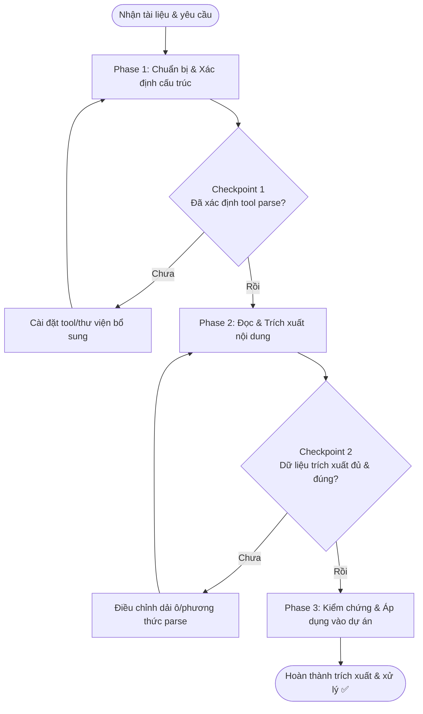

# Document Reading & Processing Workflow

> Quy trình từng bước hướng dẫn cách tiếp nhận, đọc và áp dụng thông tin từ các tệp tài liệu trong dự án.  
> Áp dụng khi Developer cung cấp tài liệu specs, cấu hình Excel, hoặc tài liệu hướng dẫn và yêu cầu Agent phân tích hoặc phát triển tính năng dựa trên tài liệu đó.

---

## 🚀 Trigger — Khi Nào Dùng Workflow Này?

Sử dụng workflow này khi:
- Nhận được tài liệu yêu cầu nghiệp vụ (Business Specs) dạng `.docx` hoặc `.md`.
- Cần đọc cấu hình hệ thống hoặc dữ liệu mẫu từ các file Excel `.xlsx`.
- Cần nghiên cứu tài liệu hướng dẫn phát triển của dự án trong các tệp `.md`.

---

## 📋 Điều Kiện Tiên Quyết (Prerequisites)

### Thông tin cần có
- [ ] Đường dẫn của tệp tài liệu cần đọc trong workspace.
- [ ] Mục tiêu phân tích (ví dụ: trích xuất cấu hình kết nối, tìm hiểu spec để code UI...).

### Công cụ / Môi trường cần có
- [ ] Môi trường Python (được khuyến nghị cho việc parse `.docx`, `.xlsx`).
- [ ] Quyền đọc file trên phân vùng chứa tài liệu.

### Skills tham chiếu
- [`document-reading-skill`](../skills/document-reading-skill.md) — Core skill sử dụng trong Phase 2.

### Rules áp dụng
- [`document-reading`](../rules/document-reading.md) — Quy tắc định dạng và phương pháp đọc.
- [`coding-standards`](../rules/coding-standards.md) — Áp dụng nếu cần viết code trích xuất.

---

## 🗺️ Flow Diagram

---

## 📌 Các Phase & Bước Chi Tiết

---

### Phase 1: Chuẩn Bị & Xác Định Cấu Trúc ⏱️ ~10 phút

**Mục tiêu**: Xác định định dạng tệp tin, kiểm tra tính sẵn sàng của công cụ và chuẩn bị kế hoạch đọc phù hợp.

#### Bước 1.1: Triage — Xác Định Định Dạng & Độ Lớn Tài Liệu
**Ai thực hiện**: 🤖 Agent  
**Action**:
- Kiểm tra định dạng tệp (`.docx`, `.xlsx`, `.md`).
- Đánh giá dung lượng file (KiloBytes / MegaBytes) để quyết định xem có cần phân trang (chunking) hay không.

#### Bước 1.2: Thiết Lập Công Cụ Parsing
**Ai thực hiện**: 🤝 Cả hai  
**Action**:
- Kiểm tra môi trường xem đã cài đặt các thư viện cần thiết chưa (như `pandas`, `openpyxl` cho Excel; `python-docx` cho Word).
- Nếu thiếu thư viện trên môi trường của Developer, Agent sẽ đề xuất lệnh cài đặt hoặc chọn giải pháp thay thế.

#### ✅ Checkpoint 1 — Công Cụ Sẵn Sàng
- [ ] Định dạng tệp đã được xác nhận.
- [ ] Thư viện hoặc công cụ parse phù hợp đã sẵn sàng hoạt động.

---

### Phase 2: Đọc & Trích Xuất Dữ Liệu ⏱️ ~15-30 phút

**Mục tiêu**: Trích xuất dữ liệu thô từ tài liệu và cấu trúc hóa dữ liệu đó về dạng Markdown để dễ dàng phân tích.

#### Bước 2.1: Thực Thi Đọc Tài Liệu (Sử dụng Skill)
**Ai thực hiện**: 🤖 Agent (Sử dụng skill [`document-reading-skill`](../skills/document-reading-skill.md))  
**Action**:
- Chạy script/lệnh để đọc nội dung file.
- Áp dụng các quy tắc trong [`document-reading`](../rules/document-reading.md):
  - Excel: Đọc theo dải ô (Range) hoặc phân trang nếu dung lượng lớn.
  - Word: Nhận diện bảng biểu và định dạng về Markdown Table.
  - Markdown: Phân tích cấu trúc Headings và Front Matter.

#### Bước 2.2: Chunking (Nếu File Lớn)
**Ai thực hiện**: 🤖 Agent  
**Action**:
- Nếu tài liệu quá dài, Agent sẽ đọc lần lượt từng phần (Chunks) và tóm tắt nhanh mỗi phần để tránh tràn bộ nhớ ngữ cảnh.

#### ✅ Checkpoint 2 — Nội Dung Đã Được Trích Xuất
- [ ] Dữ liệu quan trọng đã được trích xuất thành công.
- [ ] Dữ liệu được cấu trúc hóa rõ ràng bằng bảng hoặc danh sách Markdown.

---

### Phase 3: Kiểm Chứng & Áp Dụng ⏱️ ~10-20 phút

**Mục tiêu**: Xác minh lại tính chính xác của dữ liệu trích xuất với Developer và áp dụng dữ liệu đó vào dự án.

#### Bước 3.1: Verify Dữ Liệu Với Developer
**Ai thực hiện**: 🤝 Cả hai  
**Action**:
- Agent hiển thị bản tóm tắt dữ liệu cấu trúc hóa cho Developer xem xét.
- Developer xác nhận dữ liệu đã chính xác và đầy đủ so với file gốc.

#### Bước 3.2: Áp Dụng Dữ Liệu Vào Thực Tế
**Ai thực hiện**: 🤖 Agent  
**Action**:
- Sử dụng các thông tin/cấu hình đã trích xuất được để tiến hành các bước tiếp theo của dự án (ví dụ: tạo file config mới, triển khai logic code dựa trên spec...).

#### ✅ Checkpoint Cuối — Quy Trình Hoàn Thành
- [ ] Dữ liệu được xác nhận bởi Developer.
- [ ] Các thay đổi/áp dụng logic trong dự án dựa trên tài liệu đã được thực hiện.

---

## 🎯 Kết Quả Mong Đợi (Expected Outcome)

Sau khi hoàn thành workflow này:
- Toàn bộ nội dung hoặc các phần cấu hình quan trọng từ tài liệu đã được chuyển đổi về Markdown sạch sẽ và lưu trong ngữ cảnh hoặc tài liệu phụ trợ.
- Dự án được cập nhật cấu hình hoặc mã nguồn đúng theo đặc tả nghiệp vụ trong tài liệu gốc.

---

## 🔀 Xử Lý Trường Hợp Đặc Biệt (Edge Cases)

### File bị khóa hoặc mật khẩu bảo vệ (Password Protected)
-> Báo cáo lỗi cho Developer để cung cấp bản không khóa hoặc cung cấp mật khẩu để xử lý qua script.

### File excel có định dạng ô quá phức tạp (Merged cells)
-> Agent sẽ parse dữ liệu thô và hiển thị dạng dòng thô, nhờ Developer làm rõ các ô bị gộp (merged) nếu chúng ảnh hưởng đến logic cấu hình.

---

## ⚠️ Lưu Ý (Notes)

> [!IMPORTANT]
> Luôn verify lại cấu trúc bảng biểu Excel hoặc Word sau khi parse. Merged cells hoặc công thức ẩn đôi khi có thể bị mất mát dữ liệu khi parse qua Python.

---

## 📝 Lịch Sử Thay Đổi (Changelog)

| Version | Ngày | Thay đổi |
|---------|------|---------|
| 1.0.0 | 2026-06-11 | Khởi tạo |
