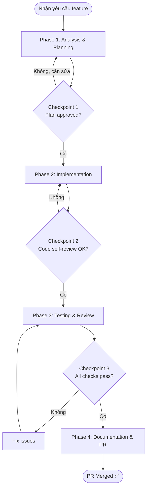

# New Feature Development

> Quy trình phát triển một feature mới từ yêu cầu đến Pull Request được merge.  
> Áp dụng cho các features vừa và lớn có độ phức tạp nhất định.

---

## 🚀 Trigger — Khi Nào Dùng Workflow Này?

Sử dụng workflow này khi:
- Nhận được yêu cầu thêm feature mới (từ ticket, user request, hoặc ý tưởng cá nhân)
- Feature đủ phức tạp để cần lên plan (không phải task 1-2 dòng)
- Cần đảm bảo feature đi kèm tests và documentation đầy đủ

---

## 📋 Điều Kiện Tiên Quyết (Prerequisites)

### Thông tin cần có
- [ ] Mô tả yêu cầu rõ ràng (user story, acceptance criteria, hoặc mô tả tự do)
- [ ] Biết tech stack và framework đang dùng trong project

### Công cụ / Access cần có
- [ ] Access vào Git repository
- [ ] Dev environment đang chạy được
- [ ] Hiểu kiến trúc tổng thể của project

### Skills tham chiếu
- [`code-review`](../skills/code-review.md) — Dùng ở Phase 3
- [`debug-assistant`](../skills/debug-assistant.md) — Dùng khi gặp lỗi trong quá trình implement

### Rules áp dụng
- [`coding-standards`](../rules/coding-standards.md) — Áp dụng suốt Phase 2
- [`communication-style`](../rules/communication-style.md) — Áp dụng khi báo cáo progress

---

## 🗺️ Flow Diagram

---

## 📌 Các Phase & Bước Chi Tiết

---

### Phase 1: Analysis & Planning ⏱️ ~30-60 phút

**Mục tiêu**: Hiểu rõ yêu cầu, quyết định approach, và tạo plan được approve trước khi code.

#### Bước 1.1: Phân Tích Yêu Cầu

**Ai thực hiện**: 🤝 Cả hai  
**Action**:
- Agent đọc và paraphrase yêu cầu để confirm hiểu đúng
- Clarify các điểm mơ hồ bằng câu hỏi cụ thể
- Xác định scope: cái gì IN scope và OUT of scope

**Output**:
- [ ] Yêu cầu được phát biểu lại rõ ràng bằng ngôn ngữ kỹ thuật
- [ ] Danh sách câu hỏi clarification (nếu có)

#### Bước 1.2: Technical Design

**Ai thực hiện**: 🤖 Agent  
**Action**:
- Phân tích codebase hiện có: các file/module liên quan
- Đề xuất approach kỹ thuật (có trade-offs nếu có nhiều lựa chọn)
- Xác định: files cần tạo mới, files cần sửa, dependencies cần thêm
- Ước tính thời gian thực hiện

**Output**:
- [ ] Technical design document (ngắn gọn, đủ dùng)
- [ ] Danh sách files sẽ thay đổi
- [ ] Thời gian ước tính

#### Bước 1.3: Tạo Task Checklist

**Ai thực hiện**: 🤖 Agent  
**Action**:
- Breakdown implementation thành các task nhỏ, có thể verify độc lập
- Sắp xếp theo thứ tự dependency

**Output**:
- [ ] Task checklist chi tiết

#### ✅ Checkpoint 1 — Plan Approval

> **Dừng lại. Agent trình bày plan, chờ bạn approve trước khi code.**

Tiêu chí hoàn thành Phase 1:
- [ ] Yêu cầu đã được clarify đầy đủ, không còn điểm mơ hồ
- [ ] Technical approach đã được chọn và có lý do rõ ràng
- [ ] Task checklist đã được review và approve
- [ ] **Bạn đã nói "OK" hoặc "Tiếp tục"** → Phase 2 bắt đầu

---

### Phase 2: Implementation ⏱️ ~2-5 giờ

**Mục tiêu**: Implement feature theo plan đã approve, commit từng bước nhỏ.

#### Bước 2.1: Setup & Scaffolding

**Ai thực hiện**: 🤖 Agent (đề xuất) → 👤 Bạn (thực hiện)  
**Action**:
- Tạo files/folders mới theo structure đã plan
- Setup boilerplate code
- Tạo git branch: `feature/[ticket-id]-[mô-tả-ngắn]`

**Output**:
- [ ] Branch mới được tạo
- [ ] File structure sẵn sàng

#### Bước 2.2: Core Implementation

**Ai thực hiện**: 🤝 Cả hai  
**Action**:
- Implement từng task trong checklist, theo thứ tự
- Sau mỗi task nhỏ: commit với message theo Conventional Commits (Agent **LUÔN** chủ động gợi ý commit message tương ứng sau khi đề xuất hoặc thực hiện thay đổi)
- Áp dụng `coding-standards` rule suốt quá trình

**Output**:
- [ ] Mỗi task trong checklist có commit tương ứng
- [ ] Code tuân theo coding standards

#### Bước 2.3: Self-Review

**Ai thực hiện**: 🤖 Agent  
**Action**:
- Dùng skill `code-review` để review code vừa viết (focus: correctness + security)
- List ra các issues (nếu có) và tự fix

**Output**:
- [ ] Code review report
- [ ] Issues đã được fix

#### ✅ Checkpoint 2 — Code Self-Review

Tiêu chí hoàn thành Phase 2:
- [ ] Tất cả tasks trong checklist đã hoàn thành
- [ ] Không còn Critical/Major issues từ self-review
- [ ] Không có `console.log` hay debug statements thừa
- [ ] Code build thành công (nếu applicable)

---

### Phase 3: Testing ⏱️ ~1-2 giờ

**Mục tiêu**: Đảm bảo feature hoạt động đúng và không break things hiện có.

#### Bước 3.1: Viết Unit Tests

**Ai thực hiện**: 🤖 Agent  
**Action**:
- Viết unit tests cho các functions/components mới
- Cover happy path + edge cases + error cases
- Target coverage: ≥ 80% cho code mới

**Output**:
- [ ] Unit tests đã viết và pass
- [ ] Coverage report

#### Bước 3.2: Integration Testing

**Ai thực hiện**: 👤 Bạn  
**Action**:
- Test thủ công feature trên dev environment
- Check integration với các features khác
- Test trên các scenarios thực tế

**Output**:
- [ ] Không có regression bugs
- [ ] Feature hoạt động đúng với acceptance criteria

#### Bước 3.3: Edge Case Testing

**Ai thực hiện**: 🤝 Cả hai  
**Action**:
- Agent đề xuất danh sách edge cases cần test
- Bạn test các edge cases đó

**Output**:
- [ ] Edge cases đã được test và document

#### ✅ Checkpoint 3 — Testing Complete

Tiêu chí hoàn thành Phase 3:
- [ ] Unit tests viết xong và pass 100%
- [ ] Manual testing không phát hiện bug mới
- [ ] Acceptance criteria từ Phase 1 được fulfill
- [ ] Không có regression trên features hiện có

---

### Phase 4: Documentation & PR ⏱️ ~30 phút

**Mục tiêu**: Document feature và tạo PR để review.

#### Bước 4.1: Update Documentation

**Ai thực hiện**: 🤖 Agent  
**Action**:
- Update README nếu feature thay đổi cách dùng
- Update API docs nếu có endpoint mới
- Update CHANGELOG nếu project có

**Output**:
- [ ] Docs đã update

#### Bước 4.2: Tạo Pull Request

**Ai thực hiện**: 🤖 Agent (draft) → 👤 Bạn (submit)  
**Action**:
- Agent tạo nội dung PR description:
  - Summary of changes
  - How to test
  - Screenshots (nếu có UI changes)
- Bạn tạo PR trên GitHub/GitLab với nội dung đó

**Output**:
- [ ] PR được tạo với description đầy đủ
- [ ] PR được assign reviewer (nếu applicable)

#### ✅ Checkpoint Cuối — Definition of Done

Workflow hoàn thành khi:
- [ ] Feature implement đúng với yêu cầu
- [ ] Tests viết đầy đủ và pass
- [ ] Documentation update xong
- [ ] PR tạo xong với description rõ ràng
- [ ] Code được merge (hoặc đang chờ review)

---

## 🎯 Kết Quả Mong Đợi (Expected Outcome)

Sau khi hoàn thành workflow này:
- Feature mới hoạt động đúng trên dev environment
- Unit tests cover ≥ 80% code mới, tất cả pass
- PR tạo xong với description đầy đủ theo template
- Không có regressions trên codebase hiện có
- Documentation update nếu cần thiết

---

## 🔀 Xử Lý Trường Hợp Đặc Biệt (Edge Cases)

### Khi phát hiện yêu cầu mơ hồ ở giữa Phase 2
→ Dừng implement, quay lại Phase 1 để clarify. Đừng đoán.

### Khi scope creep xảy ra (phát hiện thêm việc cần làm)
→ Tạo ticket mới cho phần scope mở rộng. Giữ PR hiện tại tập trung.

### Khi gặp bug kỳ lạ trong quá trình implement
→ Dùng skill [`debug-assistant`](../skills/debug-assistant.md) trước khi tiếp tục.

---

## ⚠️ Lưu Ý (Notes)

> [!IMPORTANT]
> Không bao giờ bỏ qua Checkpoint 1 (Plan Approval). Code viết sai direction sẽ tốn nhiều thời gian sửa hơn là lên plan trước.

> [!TIP]
> Commit thường xuyên với message rõ ràng. Mỗi task trong checklist nên có ít nhất 1 commit. Giúp dễ revert nếu cần.

---

## 📝 Lịch Sử Thay Đổi (Changelog)

| Version | Ngày | Thay đổi |
|---------|------|---------|
| 1.0.0 | 2026-06-08 | Khởi tạo |
| 1.0.1 | 2026-06-13 | Thêm quy tắc Agent luôn gợi ý commit message sau mỗi thay đổi |
