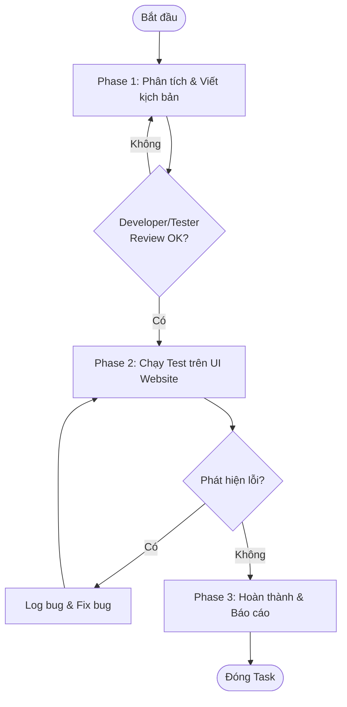

# Web UI Functional Testing Workflow

> Quy trình phối hợp tinh gọn để sinh kịch bản, chuyển giao cho tester thực hiện kiểm thử chức năng thủ công (Manual Test) trên website và xác nhận lỗi.

---

## 🚀 Trigger — Khi Nào Dùng Workflow Này?

Sử dụng workflow này khi:
- Một tính năng mới vừa được code xong trên website và cần chuyển sang môi trường Staging/Testing để kiểm thử.
- Có sự thay đổi hoặc refactor lớn về mặt logic nghiệp vụ trên giao diện website cần kiểm thử lại (Regression Test).
- Tester cần một kịch bản kiểm thử rõ ràng để thực thi nhằm tránh bỏ sót lỗi trước khi release.

---

## 📋 Điều Kiện Tiên Quyết (Prerequisites)

### Thông tin cần có
- [ ] Mô tả chi tiết tính năng mới hoặc mô tả Pull Request (PR).
- [ ] Link website phiên bản thử nghiệm (Staging / Development link) hoặc hướng dẫn chạy locally.
- [ ] Tài khoản test có sẵn dữ liệu cần thiết (User credentials).

### Skills tham chiếu
- [`generate-web-ui-functional-tests.md`](../skills/generate-web-ui-functional-tests.md)

### Rules áp dụng
- [`web-ui-functional-testing-rules.md`](../rules/web-ui-functional-testing-rules.md)

---

## 🗺️ Flow Diagram

---

## 📌 Các Phase & Bước Chi Tiết

---

### Phase 1: Phân tích & Viết kịch bản ⏱️ ~30 phút

**Mục tiêu phase này**: Tạo ra bộ kịch bản kiểm thử (Test Cases) đầy đủ, chi tiết và được sự đồng thuận của team.

#### Bước 1.1: Tạo kịch bản kiểm thử nháp
**Ai thực hiện**: 🤖 Agent  
**Action**:
- Sử dụng kỹ năng [`generate-web-ui-functional-tests.md`](../skills/generate-web-ui-functional-tests.md) để đọc mô tả tính năng.
- Viết kịch bản test nháp gồm Positive, Negative, và Edge Cases.
**Output**:
- File kịch bản nháp `test_scenarios_[tên-tính-năng].md` chứa danh sách test cases.

#### Bước 1.2: Xem xét và duyệt kịch bản
**Ai thực hiện**: 👤 Tester / Developer  
**Action**:
- Đọc qua file kịch bản nháp do Agent tạo ra.
- Xác nhận các bước đã đủ chi tiết chưa, có thiếu trường hợp nghiệp vụ thực tế nào không.
- Góp ý để Agent chỉnh sửa nếu cần.
**Output**:
- File kịch bản kiểm thử chính thức được duyệt.

#### ✅ Checkpoint 1
> **Dừng lại và xác nhận trước khi bắt đầu Phase 2.**
- [ ] Kịch bản test bao gồm ít nhất cả Positive và Negative cases.
- [ ] Môi trường test và tài khoản test đã sẵn sàng.

---

### Phase 2: Chạy Test trên UI Website ⏱️ ~45 phút

**Mục tiêu phase này**: Tester chạy qua từng test case trên giao diện website thật để xác định chức năng chạy đúng hay sai.

#### Bước 2.1: Thực thi kiểm thử thủ công (Manual Testing)
**Ai thực hiện**: 👤 Tester  
**Action**:
- Mở website phiên bản thử nghiệm.
- Làm theo chính xác các bước (Test Steps) được viết trong kịch bản chính thức.
- Đối chiếu kết quả thực tế trên màn hình với Kết quả mong đợi (Expected Result).
- Ghi nhận trạng thái: `PASS` (nếu đúng) hoặc `FAIL` (nếu sai lệch).
**Output**:
- Kết quả chạy test được điền trực tiếp vào kịch bản test (cập nhật cột Actual Result & Status).

#### Bước 2.2: Báo cáo và sửa lỗi (Nếu có lỗi)
**Ai thực hiện**: 🤝 Cả hai (Tester log lỗi - Developer sửa - Agent hỗ trợ phân tích)  
**Action**:
- Nếu một test case bị `FAIL`:
  - Tester chụp ảnh màn hình lỗi, ghi rõ bước bị lỗi và mô tả kết quả thực tế.
  - Developer tiến hành sửa code.
  - Sau khi sửa xong, Tester tiến hành test lại các bước của test case đó cho đến khi `PASS`.
**Output**:
- Các lỗi được khắc phục và test lại thành công.

#### ✅ Checkpoint 2
> **Dừng lại và xác nhận trước khi tiếp tục Phase 3.**
- [ ] 100% các kịch bản test quan trọng (Happy Path) phải ở trạng thái `PASS`.
- [ ] Không còn lỗi blocker (lỗi chặn tiến độ) hoặc lỗi nghiêm trọng chưa được sửa.

---

### Phase 3: Hoàn thành & Báo cáo ⏱️ ~15 phút

**Mục tiêu phase này**: Tổng kết kết quả và đóng task.

#### Bước 3.1: Tổng hợp kết quả
**Ai thực hiện**: 🤖 Agent / 👤 Tester  
**Action**:
- Thống kê tỷ lệ Pass/Fail (ví dụ: Tổng số 10 TC, Pass: 10, Fail: 0).
- Lưu trữ kịch bản kiểm thử đã thực thi vào thư mục lưu trữ của dự án để làm tài liệu Regression Test sau này.
**Output**:
- Báo cáo kết quả kiểm thử (Test Summary Report) ngắn gọn.

#### ✅ Checkpoint Cuối — Definition of Done
Workflow hoàn thành khi:
- [ ] Có file kịch bản kiểm thử chính thức lưu trong dự án.
- [ ] Toàn bộ các test case đã được thực thi và cập nhật kết quả.
- [ ] Báo cáo kết quả kiểm thử được gửi cho dự án.

---

## 🎯 Kết Quả Mong Đợi (Expected Outcome)

Sau khi hoàn thành workflow này:
- Tính năng mới trên giao diện website được đảm bảo chạy đúng nghiệp vụ trước khi đưa tới người dùng cuối.
- Có bộ tài liệu kịch bản kiểm thử lưu trữ phục vụ cho các đợt phát hành sau.

---

## 🔀 Xử Lý Trường Hợp Đặc Biệt (Edge Cases)

### Khi phát hiện lỗi giao diện nhỏ (UI Typo/Alignment) không ảnh hưởng logic
→ Vẫn đánh dấu `PASS` cho chức năng chính nhưng ghi chú lỗi giao diện vào cột Ghi chú để fix sau, tránh làm nghẽn tiến trình release.

### Khi môi trường test bị sập giữa chừng
→ Đánh dấu trạng thái các test case chưa chạy là `BLOCKED`. Thông báo cho developer để khôi phục môi trường rồi tiếp tục test sau.

---

## ⚠️ Lưu Ý (Notes)

> [!IMPORTANT]
> Tester phải test trên cả các trình duyệt phổ biến (Chrome, Safari, Edge) hoặc trên thiết bị di động (nếu website hỗ trợ Responsive) để đảm bảo độ bao phủ.

- Luôn chụp ảnh/quay video màn hình làm bằng chứng khi phát hiện lỗi (Bug Evidence).
- Không được bỏ qua các bước kiểm thử lỗi (Negative cases) vì đây là nơi dễ xảy ra crash hệ thống nhất.

---

## 📝 Lịch Sử Thay Đổi (Changelog)

| Version | Ngày | Thay đổi |
|---------|------|---------|
| 1.0.0 | 2026-06-15 | Khởi tạo tài liệu quy trình kiểm thử chức năng giao diện web |
